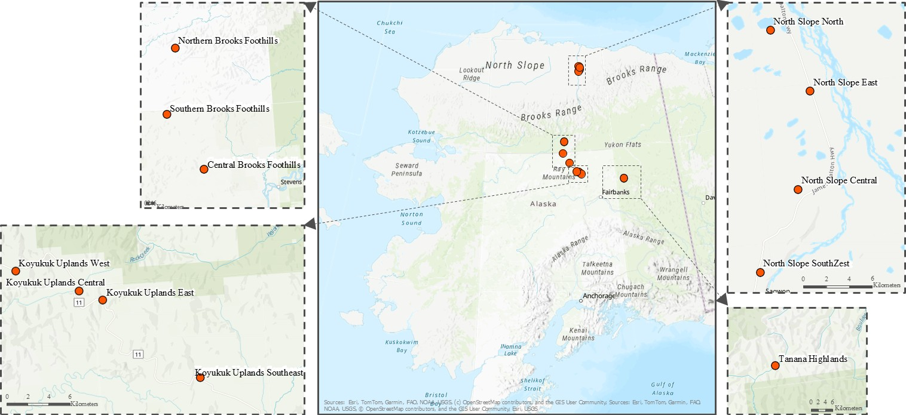

<p align="center">
  
</p>

# Alaska-COLD: Hourly Air and Soil Temperature Observations from Interior and Northern Alaska (2023–2025)

This repository hosts the **Alaska Coupled Observations of Land–atmosphere Dynamics (Alaska-COLD)** dataset and companion code. Alaska-COLD provides multi-year, hourly air and soil temperature records from a network of 12 monitoring sites across interior and northern Alaska (64–70°N), spanning boreal forest and Arctic tundra and both discontinuous and continuous permafrost.

The dataset is described in detail in:

> Ahajjam et al., 2025: *Alaska-COLD: Linking Surface Climate and Subsurface Thermal Dynamics in a Multi-Year Hourly Temperature Dataset From Interior and Northern Alaska*, Earth System Science Data (in review).

Please cite this paper if you use Alaska-COLD in your work.

---

## 1. Overview

Alaska-COLD was developed to provide ground-based reference data for:

- Understanding how air temperature and soil temperature co-vary through freeze–thaw seasons.
- Characterizing permafrost thermal regimes along an Alaskan climate gradient.
- Calibrating and evaluating land surface, permafrost, and infrastructure models.
- Benchmarking remote sensing and machine learning methods that predict ground thermal state.

Each site records **hourly** air temperature and soil temperature at **four depths (0–0.7 m)**, capturing multiple freeze–thaw cycles between summer 2023 and 2025. In addition, sites 3 and 6 contain additional environmental parameters.  

---


## 2 Site overview
<p align="center">
 
</p>

The Alaska-COLD network consists of 12 monitoring sites spanning interior and northern Alaska. Each site is instrumented with one air temperature sensor and four soil temperature probes at different depths.

| Site name (ID)                   | Latitude (°N) | Longitude (°; negative = west) | Elevation (m a.s.l.)¹ | Record period (start–end)     | Soil depths (cm; probes 1–4)      |
|----------------------------------|---------------|----------------------------------|------------------------|--------------------------------|-----------------------------------|
| Southern Brooks Foothills (3)   | 66.48         | -150.69                         | 610.4                  | 05 Aug 2023 – 27 Jul 2025      | 0, 13.9, 29.2, 45.1               |
| Koyukuk Uplands Central (4)     | 65.79         | -149.44                         | 335.06                 | 08 Aug 2023 – 30 Jul 2025      | 0, 12.4, 26.8, 40.9               |
| Koyukuk Uplands East (5)        | 65.79         | -149.39                         | 496.64                 | 09 Aug 2023 – 27 Jul 2025      | 0, 18.7, 39.9, 59.8               |
| Koyukuk Uplands Southeast (6)   | 65.71         | -149.20                         | 235.96                 | 11 Aug 2023 – 30 Jul 2025      | 0, 16.0, 31.9, 48.3               |
| Koyukuk Uplands West (7)        | 65.82         | -149.57                         | 493.59                 | 10 Aug 2023 – 08 May 2024      | 0, 16.7, 33.2, 49.4               |
| North Slope Central (9)         | 69.45         | -148.63                         | 227.28                 | 02 Aug 2023 – 28 Jul 2025      | 0, 8.0, 21.0, 34.0                |
| Central Brooks Foothills (10)   | 66.13         | -150.17                         | 244.60                 | 24 Jul 2024 – 27 Jul 2025      | 0, 24.2, 47.0, 69.8               |
| Tanana Highlands (11)           | 65.41         | -145.58                         | 706.34                 | 12 Aug 2023 – 26 Jul 2025      | 0, 18.9, 37.1, 55.3               |
| North Slope Southwest (13)      | 69.39         | -148.73                         | 291.92                 | 03 Aug 2023 – 28 Jul 2025      | 0, 8.4, 19.6, 31.5                |
| Northern Brooks Foothills (14)  | 66.89         | -150.51                         | 357.81                 | 04 Aug 2023 – 24 Jul 2024      | 0, 24.0, 48.0, 72.0               |
| North Slope North (15)          | 69.58         | -148.67                         | 145.41                 | 11 Jan 2025 – 29 Jul 2025      | 0, 10.5, 23.0, 34.5               |
| North Slope East (18)           | 69.53         | -148.59                         | 162.18                 | 23 Jul 2024 – 28 Jul 2025      | 0, 12.33, 24.67, 37.0             |

¹ Elevation in metres above sea level (m a.s.l.).

## 3. Dataset content

### 3.1 File naming

Site-level time series are stored as:

```
Data/Alaska-COLD_Site3.csv
Data/Alaska-COLD_Site4.csv
...
Data/Alaska-COLD_Site18.csv
```
### 3.2 Standardized column names

Column names have been standardized across sites. The core variables that appear in every Alaska-COLD_Site<X>.csv are:

DateTime – timestamp (see metadata for time zone and format)

AirTemp_C – near-surface air temperature (°C)

Soil1Temp_C – soil temperature at the shallowest depth (°C)

Soil2Temp_C – soil temperature at the second depth (°C)

Soil3Temp_C – soil temperature at the third depth (°C)

Soil4Temp_C – soil temperature at the deepest monitored depth (~0.7 m, °C)

Additional columns that may be present (primarily at Sites 3 and 6, where extended meteorological suites were installed) include:

ShortwaveFlux_Wm2_Avg – average incoming shortwave radiation (W m⁻²)

Rain_mm_Tot – total rainfall per hour (mm)

LightningStrikes_Tot – number of lightning strikes detected in the interval

LightningDist_km_Avg – average distance to detected lightning (km)

WindSpeed_ms_Avg – average wind speed (m s⁻¹)

VaporPressure_mbar_Avg – average vapor pressure (mbar)

Pressure_mbar_Avg – average air pressure (mbar)

RelativeHumidity_pct – relative humidity (%)

TCDT_C – additional temperature channel (°C), see metadata

## 4. License

**Data.** The Alaska-COLD dataset in this repository and in the archival repository  
([Ahajjam et al., 202X, Alaska-COLD data set, DOI: 10.XXXX/XXXX])  
is licensed under the **Creative Commons Attribution 4.0 International (CC BY 4.0)** license.  
You are free to share and adapt the data, provided you give appropriate credit to the creators.  


## 5. Funding and acknowledgements

Alaska-COLD was developed as part of the Defense Resiliency Platform, funded by the U.S. Army Corps of Engineers, with contributions from Virginia Tech, Stony Brook University, the University of Minnesota, the University of North Dakota, and the U.S. Army Cold Regions Research and Engineering Laboratory.

We thank all field teams and collaborators who installed and maintained the monitoring sites, processed the sensor data, and contributed to quality control.
