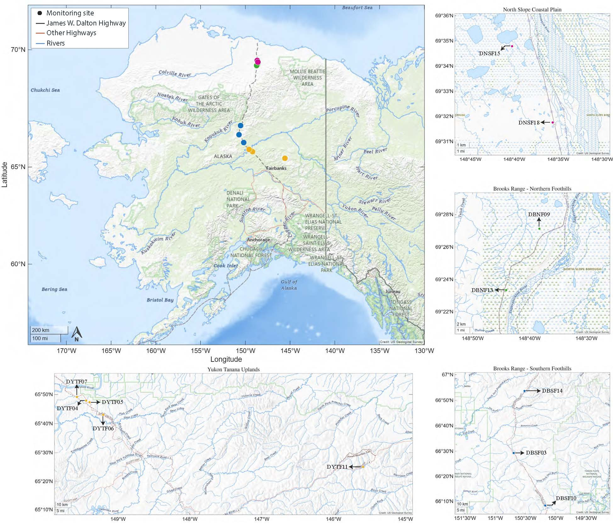

<p align="center">
  
  
</p>

# Alaska-COLD: Hourly Air and Ground Temperature Observations from Interior and Northern Alaska (2023-2026)

This repository hosts the **Alaska Coupled Observations of Land-atmosphere Dynamics (Alaska-COLD)** dataset and companion code. Alaska-COLD provides hourly air and shallow-ground temperature records from 12 monitoring sites across interior and northern Alaska (65.4-69.6°N). The network spans boreal forest and Arctic tundra in continuous and discontinuous permafrost zones. Record lengths differ among stations and extend from August 2023 through August 2026.

The dataset is described in:

> Ahajjam, A., Caparó Bellido, A., Wilcox, A., Soaper, M., Patterson, H., Weaver, S., Kidanu, S., and Pasch, T. (2026). *Alaska-COLD: Linking Surface Temperatures and Subsurface Thermal Dynamics in a Multi-Year Hourly Dataset From Interior and Northern Alaska*. Earth System Science Data Discussions, in review. [https://doi.org/10.5194/essd-2026-213](https://doi.org/10.5194/essd-2026-213)

The dataset archive is available at [https://doi.org/10.5281/zenodo.17980271](https://doi.org/10.5281/zenodo.17980271). Please cite the paper when using Alaska-COLD.

---

## 1. Overview

Alaska-COLD was developed to provide ground-based reference observations for:

- Examining how air and shallow-ground temperatures co-vary through freeze-thaw seasons.
- Characterizing ground thermal regimes along an Alaskan climate and vegetation gradient.
- Evaluating land-surface, permafrost, ecological, and infrastructure models.
- Benchmarking remote-sensing and machine-learning methods that estimate ground thermal state.

Each station records near-surface air temperature and ground temperature at four probe positions. The shallowest ground probe is designated **P1**, and the other three probes are installed at station-specific vertical offsets below P1. Two stations, DBSF03 and DYTF06, also record selected meteorological and snow variables.

> **Depth convention:** `GroundTemp_0cm_C` denotes P1 and uses P1 as the local zero reference. It does **not** necessarily represent the top of the moss, organic horizon, or mineral soil. At most stations, P1 is within the organic layer. Use the P1 installation position and organic-layer metadata below when interpreting temperature by depth.

All published timestamps are in Coordinated Universal Time (UTC).

---

## 2. Site metadata

<p align="center">
  
</p>

### 2.1 Monitoring configuration

Sites are ordered from north to south. P2-P4 values are vertical offsets downward from P1. Negative longitude denotes west.

| **Region** | **Station ID** | **Latitude** (°) | **Longitude (°)** | **Elevation (m)** | **Record period** | **Air-sensor height (m)** | **P1 installation position** | **P2-P4 offsets below P1 (cm)** |
|:---|:---:|:---:|:---:|:---:|:---:|:---:|:---:|:---:|
| North Slope Coastal Plain | DNSF15 | 69.579838 | -148.670741 | 145.41 | 2025-01-11 to 2025-09-23 | 0.94 | Within organic layer | 10.5, 23.0, 34.5 |
| North Slope Coastal Plain | DNSF18 | 69.529292 | -148.593929 | 162.18 | 2024-07-23 to 2026-08-08 | 1.30 | Within organic layer | 12.33, 24.67, 37.0 |
| Brooks Range, northern foothills | DBNF09 | 69.452173 | -148.638054 | 227.28 | 2023-08-03 to 2026-08-20 | 1.00 | Within organic layer | 8.0, 21.0, 34.0 |
| Brooks Range, northern foothills | DBNF13 | 69.389001 | -148.735198 | 291.92 | 2023-08-03 to 2025-07-28 | 1.10 | Within organic layer | 8.4, 19.6, 31.5 |
| Brooks Range, southern foothills | DBSF14 | 66.894138 | -150.515111 | 357.81 | 2023-08-05 to 2024-07-24 | 1.80 | Organic-layer surface | 24.0, 48.0, 72.0 |
| Brooks Range, southern foothills | DBSF03 | 66.488259 | -150.695732 | 610.40 | 2023-08-05 to 2026-08-14 | 1.70 | Within organic layer | 13.9, 29.2, 45.1 |
| Brooks Range, southern foothills | DBSF10 | 66.138147 | -150.173456 | 244.60 | 2024-07-25 to 2026-08-14 | 1.30 | Within organic layer | 24.2, 47.0, 69.8 |
| Yukon-Tanana Uplands | DYTF07 | 65.819491 | -149.571774 | 493.59 | 2023-08-10 to 2026-08-12 | 1.70 | Organic-layer surface | 16.7, 33.2, 49.4 |
| Yukon-Tanana Uplands | DYTF04 | 65.798635 | -149.443200 | 335.06 | 2023-08-09 to 2025-08-16 | 1.50 | Within organic layer | 12.4, 26.8, 40.9 |
| Yukon-Tanana Uplands | DYTF05 | 65.789522 | -149.395576 | 496.64 | 2023-08-09 to 2026-08-10 | 1.60 | Within organic layer | 18.7, 39.9, 59.8 |
| Yukon-Tanana Uplands | DYTF06 | 65.717295 | -149.204995 | 235.96 | 2023-08-11 to 2026-08-10 | 1.60 | Within organic layer | 16.0, 31.9, 48.3 |
| Yukon-Tanana Uplands | DYTF11 | 65.417338 | -145.586821 | 706.34 | 2023-08-13 to 2026-08-06 | 1.00 | Dead-moss layer | 18.9, 37.1, 55.3 |


### 2.2 Ecological and subsurface characteristics

Vegetation descriptions and height ranges are local field observations. 

| **Station ID** | **Organic-layer thickness (cm)** | **Observed vegetation height (cm)** | **Field vegetation description** | **Reported soil texture** | **Permafrost zone** |
|---:|:---:|:---:|:---:|:---:|:---:|
| DNSF15 | 40 | 20.32-33.02 | Wet sedge-cottongrass tundra with scattered dwarf shrubs | Loam | Continuous |
| DNSF18 | 20 | 22.86-38.10 | Wet sedge-cottongrass tundra with sparse dwarf shrubs | Loam | Continuous |
| DBNF09 | 10.1 | 12.70-43.18 | Tussock-sedge tundra with sparse dwarf shrubs and moss-lichen cover | Silt loam | Continuous |
| DBNF13 | 14 | 10.16-38.10 | Tussock-sedge tundra with low dwarf shrubs | Silt loam | Continuous |
| DBSF14 | - | 30.5-317.5 | Burned black spruce woodland with sedge regrowth | Sandy loam | Discontinuous |
| DBSF03 | 20.3 | 45.7-208.3 | Open shrub-graminoid tundra with sparse spruce | Sandy loam | Discontinuous |
| DBSF10 | 15.2 | 30.5-381.0 | Dense black spruce woodland with moss-lichen cover | Loam | Discontinuous |
| DYTF07 | 10.0 | 38.1-110.0 | Closed-canopy forest with a thick organic layer | Sandy loam | Discontinuous |
| DYTF04 | 18.0 | 35.6-711.2 | Dense forest with heavy moss cover | Sandy loam | Discontinuous |
| DYTF05 | 16.0 | 17.8-782.3 | Dense deciduous shrubland with abundant deadwood | Sandy loam | Discontinuous |
| DYTF06 | 21.0 | 86.0-130.0 | Open black spruce woodland with moss-lichen cover | Loam | Discontinuous |
| DYTF11 | 6.0 | 10.0-20.0 | Dense low shrubland with sparse spruce | Sandy loam | Continuous |

Permafrost zones follow the Alaska classification of [Jorgenson et al. (2008), *Permafrost Characteristics of Alaska*](https://dggs.alaska.gov/pubs/id/29801).

### 2.3 Field measurements by station and visit

The summer visit date applies to the soil-moisture spot readings and frost-probe thaw-depth measurements. Measurements were collected in August 2023 at DBSF03, DYTF04, DYTF05, DYTF06, DYTF07, DBNF09, DBSF10, DYTF11, DBNF13, and DBSF14, and in July 2024 at DNSF15 and DNSF18. The exact July sampling days were not recorded in the supplied field table. The snow columns report site means from measurements collected during the January 2024 and January 2025 visits.

| **Station ID** | **Summer visit** | **Soil-moisture spot readings[^1] (%; material and nominal depth)** | **Frost-probe thaw depth[^2]: mean [range] (cm), n**| **Jan 2024 mean snow depth / density (cm / kg m⁻³)** | **Jan 2025 mean snow depth / density (cm / kg m⁻³)** |
|:---|:---:|:---:|:---:|:---:|:---:|
| DNSF15 | 2024-07, day not recorded | No readings reported | 32.0 [30.0-34.5], *n* = 10 | Not measured | 28.5 / 201.5 |
| DNSF18 | 2024-07, day not recorded | No readings reported | 39.0 [29.5-49.5], *n* = 10 | Not measured | 28.7 / 239.3 |
| DBNF09 | 2023-08-02 | Between tussocks: 46.4; tussock top: 43.8; north-, east-, and west-wall material at 10 cm: 24.1, 4.7, 7.0; south-wall mineral soil at 25 cm: 45.6; at 38 cm: 41.9 | 46.2 [37.0-60.0], *n* = 10 | Not measured | 42.0 / 280.0 |
| DBNF13 | 2023-08-03 | Tussock top: 14.4; between tussocks: 49.5; upper peat at 8.5 cm: 19.1, 8.1; lower peat at 22.5 cm: 56.6, 43.3; mineral layer at 31 cm: 46.6 | 31.3 [24.0-38.5], *n* = 8 | Not measured | 51.9 / 240.8 |
| DBSF14 | 2023-08-04 | Top of soil: 20.9; north-pit surface at 0 cm: 49.3; north wall at 10 cm: 64.3; lower organic layer at 25 cm: 65.9; top of mineral soil at 32 cm: 51.8 | 56.7 [41.9-69.9], *n* = 10 | 62.3 / 265.0 | 66.5 / 190.2 |
| DBSF03 | 2023-08-05 | West-pit top/lower-layer entry at 20 cm: 26.3, 59.8; north-side peat moss at 9 cm: 48.0; north-side clay at 34.75 cm: 41.3 | 54.3 [45.0-76.5], *n* = 4 | 25.7 / 318.0 | 43.3 / 298.0 |
| DBSF10 | 2023-08-09 | Surface peat: 0.0; fresh peat moss at 12 cm: 0.0; decomposed peat at 29 cm: 3.2, 20.3, 28.2; mineral soil at 45.5 cm: 39.5, 39.3 | 66.2 [55.4-80.4], *n* = 10 | 62.7 / 255.5 | 70.1 / 178.4 |
| DYTF07 | 2023-08-10 | Top organic layer at 0 cm: 3.7, 0.2, 6.5; middle organic layer at 7 cm: 1.9, 4.8; middle mineral layer at 26.5 cm: 46.9, 47.3 | 44.7 [33.0-55.3], *n* = 13 | 80.8 / 289.4 | 88.9 / 237.8 |
| DYTF04 | 2023-08-08 | Top organic layer at 7 cm: 0.0, 3.3; decomposed layer at 16.5 cm: 43.8, 23.9; mineral soil at 20 cm: 43.5; 7 cm above the permafrost table: 42.9; surface peat moss: 0.0 | 46.8 [36.0-67.0], *n* = 11 | 61.4 / 237.8 | 77.8 / 191.4 |
| DYTF05 | 2023-08-09 | Top peat moss at 0 cm: 13.5; middle fresh peat moss at 5 cm: 26.5, 26.9; mineral material at 24 cm: 38.2, 36.9 | 53.4 [40.0-61.8], *n* = 11 | 78.8 / 274.5 | 87.9 / 239.2 |
| DYTF06 | 2023-08-12 | Top organic layer at 0 cm: 0.0, 0.0; middle organic layer at 8.75 cm: 0.0, 2.7; middle mineral soil at 34 cm: 37.2, 40.7; mineral soil at 43.5 cm: 38.2, 38.6 | 50.0 [39.0-63.0], *n* = 11 | 49.2 / 203.2 | 54.7 / 199.2 |
| DYTF11 | 2023-08-12 | Top organic material at 0 cm: 0.0, 14.3, 7.5; organic layer at 15 cm: 2.5, 17.4, 1.8; pebbly silt at 52 cm: 31.9, 30.5 | 61.1 [52.5-69.9], *n* = 6 | 35.1 / 237.0 | 38.1 / 277.0 | 

[^1]: Soil-moisture values are individual microsite readings rather than continuous measurements or site means. Values of 0.0 are reported measurements, not missing values.
[^2]: The frost-probe measurements are active-layer depths measurements using temperature probing rod (depth at which 0°C is reached); the more conservative term *thaw depth* is used here because the measurements represent conditions on the visit date and are not necessarily the annual maximum active-layer thickness. 
---

## 3. Dataset content

### 3.1 File naming

Each station time series is stored as:

```text
Data/Alaska-COLD_<StationID>.csv
```

Examples:

```text
Data/Alaska-COLD_DNSF15.csv
Data/Alaska-COLD_DYTF04.csv
Data/Alaska-COLD_DYTF06.csv
Data/Alaska-COLD_DYTF11.csv
```

### 3.2 Time and missing-data conventions

- `Timestamp_UTC` uses `yyyy-MM-dd HH:mm:ss` and is expressed in UTC.
- Records are aligned to an hourly time grid. Temperature gaps are not interpolated.
- Missing numeric values are generally encoded as `NaN` and assigned QC flag 9.
- Apply the QC flag rather than relying on the numeric value alone. A non-measurement placeholder can remain in a value field when the corresponding flag is 9.

### 3.3 Core variables

The following variables occur in each station file:

| **Column** | **Unit** | **Description** |
|:---|:---:|:---|
| `Timestamp_UTC` | UTC | Hourly timestamp in `yyyy-MM-dd HH:mm:ss` format |
| `AirTemp_C` | °C | Near-surface air temperature |
| `GroundTemp_<depth>cm_C` | °C | Ground temperature at the probe-relative depth indicated in the column name |
| `QC_<variablename>` | code | QC flag for one of the available variables in the file. Example: `QC_AirTemp_C` |

For decimal depths, `p` replaces the decimal point. For example, `GroundTemp_12p4cm_C` is the probe 12.4 cm below P1. The P1 column is `GroundTemp_0cm_C`, regardless of its position within the surface organic layer.

### 3.4 Auxiliary meteorological and snow variables

The CR350 station files for DBSF03 and DYTF06 may include the following published variables. Availability and valid coverage differ by station.

| **Column** | **Unit** | **Description** |
|:---|:---:|:---|
| `IncomingShortwave_Wm2_Avg` | W m⁻² | Hourly average incoming shortwave radiation |
| `LiquidPrecipitation_mm_Tot` | mm | Hourly liquid-precipitation total; this is not total precipitation and does not measure snowfall |
| `RelativeHumidity_pct_HourEndSample` | % | Relative humidity sampled at the end of the hour |
| `VaporPressure_hPa_Avg` | hPa | Hourly average vapour pressure |
| `BarometricPressure_hPa_Avg` | hPa | Hourly average barometric pressure |
| `WindSpeed_ms_Avg` | m s⁻¹ | Hourly average wind speed |
| `WindGust10s_ms_HourEndSample` | m s⁻¹ | 10 s wind-gust value reported for the hour |
| `WindDirection_D1_WVT_deg` | degrees | Vector wind direction |
| `InvalidWind5min_Count` | count | Number of invalid 5 min wind samples in the hour |
| `LightningStrikeCount_Tot` | count | Lightning strikes detected during the hour |
| `LightningDistance_km_Avg` | km | Average lightning distance when strikes were detected; use its QC flag because zero strikes do not yield a distance measurement |
| `SnowDepth_m` | m | Derived snow depth relative to the time-varying snow-free reference |
| `SnowDepth_isLowerBound` | 0/1 | Indicator that `SnowDepth_m` is a lower bound because the snow surface entered the sensor near field |
| `SnowReference_m` | m | Snow-free acoustic reference distance used to derive snow depth |
| `SnowReferenceUncertainty_m` | m | Estimated uncertainty of the snow-free reference distance |
| `SnowDistanceTempCorrected_m_HourEndSample` | m | Temperature-corrected acoustic distance to the detected surface |
| `SnowQualityNumber_HourEndSample` | unitless | Sensor-reported echo-quality number |

Where provided, the corresponding quality-control column is named `QC_<variable>`. Only a QC field paired with a published measurement column defines a public observation variable.

---

## 4. Quality control

Quality-control tests are applied to temperature and available auxiliary observations. Flagged values are retained so users can apply filtering rules appropriate to their analysis.

| QC flag | Meaning | Recommended interpretation |
|:---:|:---|:---|
| 0 | Pass | No tested issue was identified |
| 1 | Suspect | Retain only when the application can tolerate the documented uncertainty |
| 2 | Fail | Exclude from ordinary quantitative analysis |
| 3 | Censored or at an instrumental bound | Treat as a bound, not as an exact observation |
| 9 | Missing or no valid measurement | Treat as unavailable, regardless of any placeholder value |

For a conservative analysis, retain observations with `QC == 0`. Observations with `QC == 1` may be used with explicit sensitivity checks. Flags 2, 3, and 9 should not be treated as ordinary exact measurements. For snow depth, a lower-bound observation is also identified by `SnowDepth_isLowerBound = 1`.

Detailed test thresholds are documented in the companion paper. 

---

## 5. License

The Alaska-COLD data files and site metadata in this repository and the [archived dataset](https://doi.org/10.5281/zenodo.17980271) are licensed under the [Creative Commons Attribution 4.0 International license](https://creativecommons.org/licenses/by/4.0/) (CC BY 4.0). You may share and adapt the data provided that appropriate credit is given.


---

## 6. Funding and acknowledgements

Alaska-COLD was developed as part of the Defense Resiliency Platform, funded by the U.S. Army Corps of Engineers, with contributions from Virginia Tech, Stony Brook University, the University of Minnesota, the University of North Dakota, and the U.S. Army Cold Regions Research and Engineering Laboratory.

We thank the field teams and collaborators who installed and maintained the monitoring stations, retrieved the records, collected site metadata, and contributed to processing and quality control.
